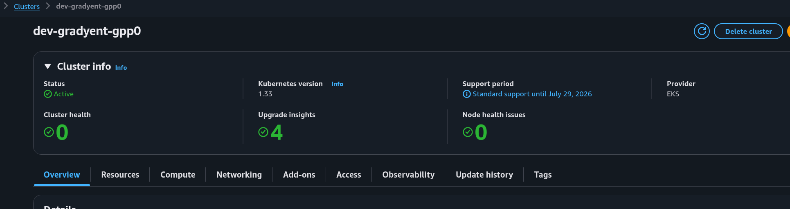
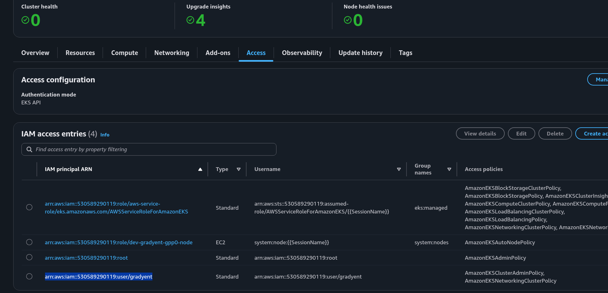
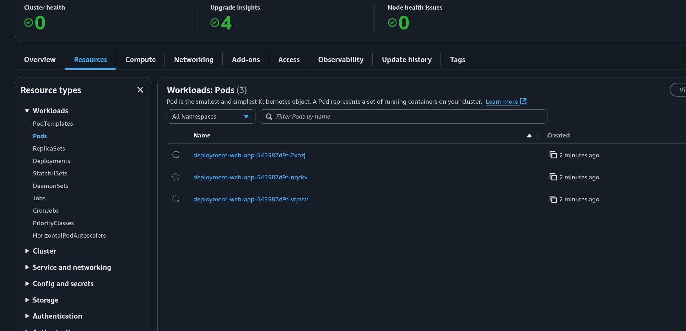
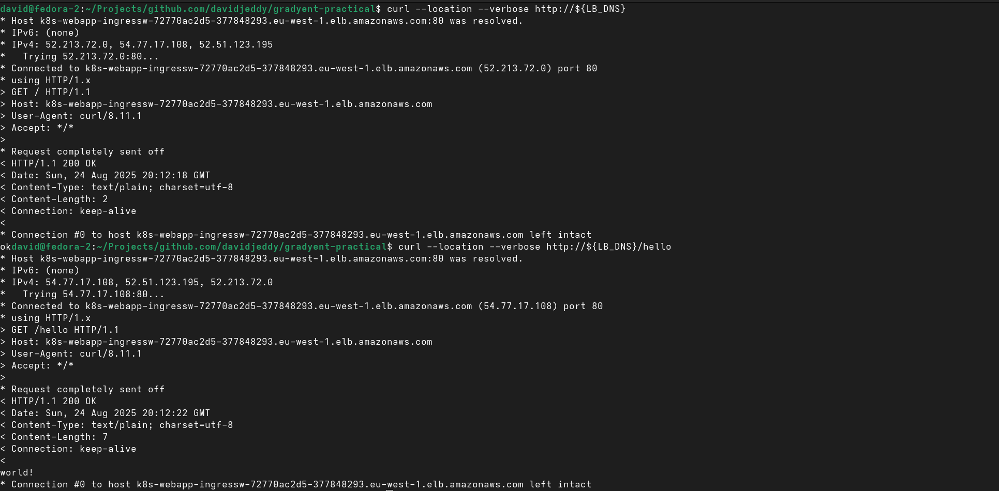
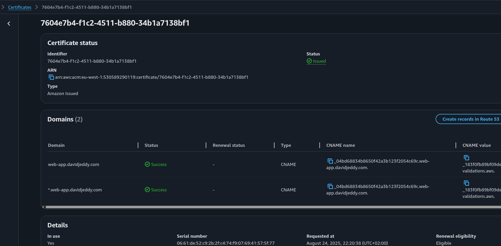
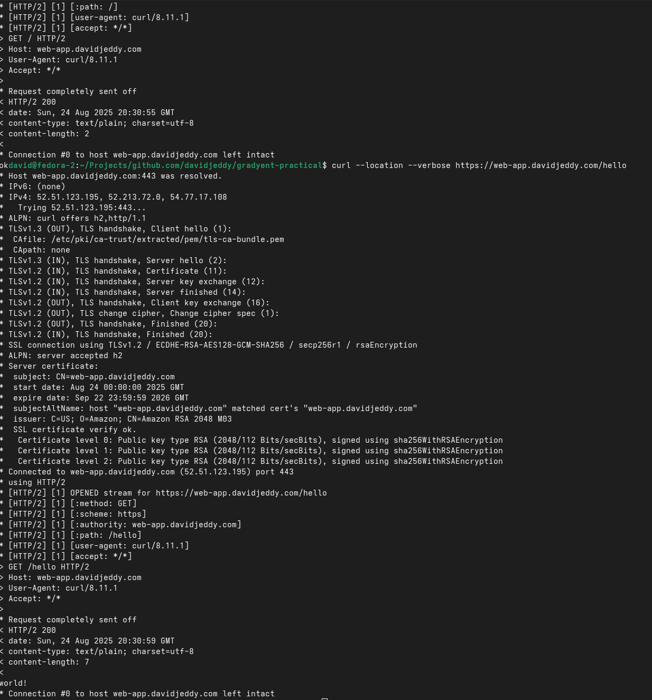

# NAME

## Table of Contents

- [NAME](#name)
  - [Table of Contents](#table-of-contents)
  - [Objective](#objective)
  - [Thought Process and Procedure Flow](#thought-process-and-procedure-flow)
  - [Requirements](#requirements)
  - [Usage](#usage)
  - [Usage - Optional](#usage---optional)
    - [Public DNS + TLS](#public-dns--tls)
    - [Generate Infra Diagram](#generate-infra-diagram)
    - [Kubernetes Dashboard](#kubernetes-dashboard)
  - [Tear-down (Delete)](#tear-down-delete)
  - [Versioning](#versioning)
  - [Contributors](#contributors)
  - [Additional Information](#additional-information)

## Objective

Sourced from [./gradyent-practical.pdf](./gradyent-practical.pdf)

What We're Looking For: Our main focus is on your solution design. Can it handle
automation and scalability in a production environment, serving hundreds of customers in
a multi-tenant setup? Completing the entire assignment is not necessary; we are primarily
interested in your approach to the problem, and we will discuss it further during the
technical interview.

Task Overview:

1. Deploy an EKS cluster using Terraform

2. Create and deploy a Helm chart for the Docker image `docker pull gradyent/tech-interview:latest`, with the following requirements

- Configure a readiness probe for :8080/ (returns "OK")

- Configure a liveness probe for :8080/hello (returns "world")

Solution Requirements: The solution should address:

- Scalability
- Monitoring
- Cost
- Ease of use

Bonus Points for including:

- CI/CD pipeline

- Ingress configuration

- An architecture diagram

- Security considerations

- Impress us

Finally, submit your solution in a Git repository, including a README file.

## Thought Process and Procedure Flow

Follow along as we think and execute the process to satisfy the practices requirements via the [./PROCESS.md](./PROCESS.md).

## Requirements

- AWS account with administrative permissions
- AWS CLI tool
- Kubernetes CLI tool
- Helm CLI tool
- (optional) AWS Route53 Hosted Zone

## Usage

```sh
declare KUBE_CLUSTER_NAME
declare LB_DNS
declare PROJECT_ROOT

git clone https://github.com/davidjeddy/gradyent-practical.git
cd gradyent-practical
export PROJECT_ROOT="$(pwd)"
echo $PROJECT_ROOT

# Deploy IAC
cd ${PROJECT_ROOT}/iac/aws/dev/eu-west-1/gpp0/core
terraform apply # this can take some time while the cluster is deployed
export KUBE_CLUSTER_NAME=$(terraform output --json | jq -rM ".cluster_name.value")
echo $KUBE_CLUSTER_NAME

# Take note of the cluster name

# Set context for kubectl
cd ${PROJECT_ROOT}
aws eks update-kubeconfig --region eu-west-1 --name "${KUBE_CLUSTER_NAME}"
kubectl cluster-info
kubectl get all -A
```



To ensure the user will have permissions to deploy resources into the cluster. In a deployment the cluster permission assignment would be determined based on some central identity and permission assignments. But here, we just assign it manually.



```sh
# Deploy Kubernetes service - Here `gpp0` is the unique deployment_id identifier
cd ${PROJECT_ROOT}
helm install web-app ./helm/web-app --values ./srv/web-app/dev/eu-west-1/gpp0/values.yaml
```



```sh
# Get the load balancer DNS
export LB_DNS="$(kubectl get Ingress/ingress-web-app-public -n web-app -o "jsonpath={.status.loadBalancer.ingress[0].hostname}")"
echo $LB_DNS

# Once the service has completed deployment it should be reachable from the public internet
curl --location --verbose http://${LB_DNS}
curl --location --verbose http://${LB_DNS}/hello
```



## Usage - Optional

### Public DNS + TLS

```sh
cd ${PROJECT_ROOT}/iac/aws/dev/eu-west-1/gpp0/acm
# Edit root_domain variable value
vi variables.tf
# Deploy IAC
terraform apply
```

Take note of the output values.

Edit the Helm values.yaml providing the TLS certificate ARN, then upgrade.

```sh
cd ${PROJECT_ROOT}
helm upgrade web-app ./helm/web-app --values ./srv/web-app/dev/eu-west-1/gpp0/values.yaml
```



Once the Helm upgrade is completed, and the TLS certificate has validated, visit the pretty DNS using TLS encryption.

```sh
curl --location --verbose https://${HTTPS_DNS_FROM_ACM_MODULE}
curl --location --verbose https://${HTTPS_DNS_FROM_ACM_MODULE}/hello
```



### Generate Infra Diagram

```sh
cd ${PROJECT_ROOT}/iac/aws/dev/eu-west-1/gpp0/core # or any other Terraform module directory
terraform plan -out plan.out
terraform show -json plan.out > plan.json
podman run --rm -it -p 9000:9000 -v $(pwd)/plan.json:/src/plan.json:z im2nguyen/rover:latest -planJSONPath=plan.json
```

### Kubernetes Dashboard

```sh
helm repo add kubernetes-dashboard https://kubernetes.github.io/dashboard/
helm upgrade --install kubernetes-dashboard kubernetes-dashboard/kubernetes-dashboard --create-namespace --namespace kubernetes-dashboard
kubectl -n kubernetes-dashboard port-forward svc/kubernetes-dashboard-kong-proxy 8443:443
```

Open browser and visit `https://localhost:8443` and follow the displayed command.

## Tear-down (Delete)

```sh
helm uninstall web-app
cd ${PROJECT_ROOT}/iac/aws/dev/eu-west-1/gpp0/acm
terraform destroy --auto-approve
cd ${PROJECT_ROOT}/iac/aws/dev/eu-west-1/gpp0/core
terraform destroy --auto-approve
```

## Versioning

This project follows [SemVer 2.0](https://semver.org/) tagging pattern.

```quote
Given a version number MAJOR.MINOR.PATCH, increment the:

1. MAJOR version when you make incompatible API changes,
2. MINOR version when you add functionality in a backwards compatible manner, and
3. PATCH version when you make backwards compatible bug fixes.

Additional labels for pre-release and build metadata are available as extensions to the MAJOR.MINOR.PATCH format.
```

## Contributors

## Additional Information

- [Changelog](https://github.com/olivierlacan/keep-a-changelog)
- Based on [README Maturity Model](https://github.com/LappleApple/feedmereadmes/blob/master/README-maturity-model.md); strive for a Level 5 `Product-oriented README`.
- [LICENSE](./LICENSE.md) sources from.
